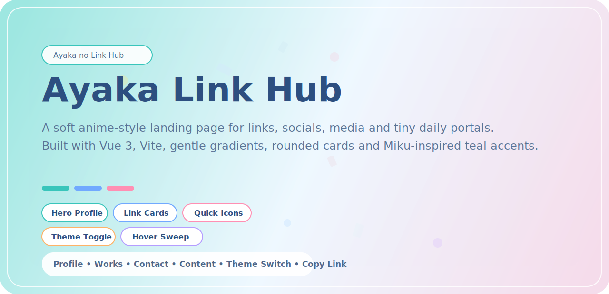

<div align="center">
  <h1>Ayaka Link Hub</h1>
  <p>一个为 Ayaka 的 Blog、社交账号、媒体内容与日常入口整理而成的二次元风链接聚合站。</p>
</div>

---

<p align="center">
  
</p>

<p align="center">
  基于 Vue 构建的个人链接站，柔和渐变、圆角卡片、初音系青绿点缀与轻动效风格，
  用一页收纳常用入口、社交账号、内容平台与一些小型日常页面。
</p>

<p align="center">
  <a href="./README.md">English</a>
  ·
  <a href="https://blog.ayakacloud.cn">博客站点</a>
  ·
  <a href="https://github.com/KasuganoAyaka">GitHub</a>
</p>

<p align="center">
  
  
  
  
  
</p>

<p align="center">
  头像主视觉 • 快捷图标 • 分组卡片 • 联系方式 • 内容兴趣 • 悬停扫光 • 复制反馈
</p>

## 项目概览

Ayaka Link Hub 是一个使用 `Vue 3 + Vite` 构建的轻量个人落地页。
它的目标不是做内容管理系统，而是把最重要的入口整理到一个视觉统一、交互轻盈、移动端友好的页面里，
作为 Anime Blog 体系外延的一张“链接名片”。

## 主要特性

- 柔和浅蓝渐变背景与初音系青绿点缀
- 带头像悬停动画的主视觉区域
- 顶部快捷图标栏，适合放常用社交与内容入口
- 分组式链接卡片，便于整理作品、联系和兴趣内容
- 更明显的悬停反馈与扫光动画
- 复制页面链接反馈与明暗主题切换
- 桌面与移动端都可正常使用

## 当前内容分区

- `作品与主站`
  个人博客、网盘、今天吃什么、项目仓库
- `与我取得联系`
  Email、Telegram、QQ、Discord
- `内容与兴趣`
  X、BiliBili、KooK Game Hub

## 技术栈

- `Vue 3`
- `Vite`
- `lucide-vue-next`
- 原生 CSS 主题变量与动画样式

## 本地启动

```bash
npm install
npm run dev
```

本地预览地址：

```text
http://127.0.0.1:4173/
```

## 构建

```bash
npm run build
```

构建产物输出到：

```text
dist/
```

## 目录结构

```text
.
├─ docs/
│  └─ readme-banner.svg
├─ public/
│  └─ ayaka.jpg
├─ src/
│  ├─ components/
│  ├─ data/
│  ├─ App.vue
│  ├─ main.js
│  └─ styles.css
├─ LICENSE
├─ README.md
├─ README_zh.md
├─ package.json
└─ vite.config.js
```

## 自定义方式

大部分站点内容都集中在：

```text
src/data/site.js
```

你可以在那里修改：

- 个人资料文案
- 快捷图标链接
- 分组内容
- 卡片标签
- 跳转地址

视觉样式和动效主要集中在：

```text
src/styles.css
```

## License

本项目采用 [MIT License](./LICENSE) 开源。
